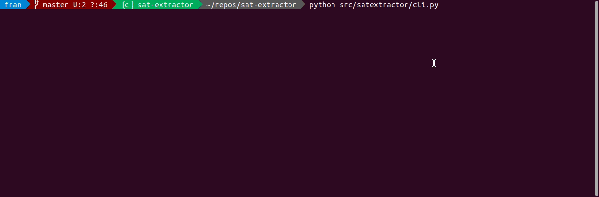
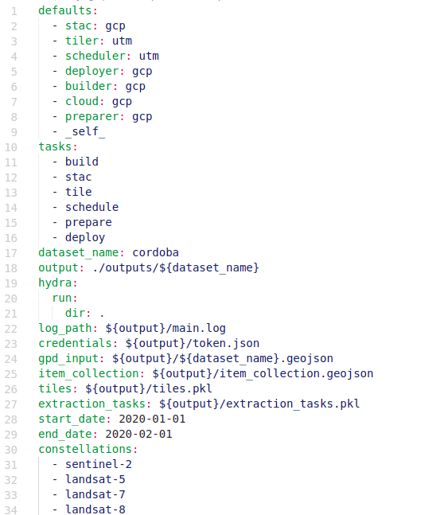

<div id="top"></div>
<!--
*** Thanks for checking out the Best-README-Template. If you have a suggestion
*** that would make this better, please fork the repo and create a pull request
*** or simply open an issue with the tag "enhancement".
*** Don't forget to give the project a star!
*** Thanks again! Now go create something AMAZING! :D
-->


<!-- PROJECT SHIELDS -->
<!--
*** I'm using markdown "reference style" links for readability.
*** Reference links are enclosed in brackets [ ] instead of parentheses ( ).
*** See the bottom of this document for the declaration of the reference variables
*** for contributors-url, forks-url, etc. This is an optional, concise syntax you may use.
*** https://www.markdownguide.org/basic-syntax/#reference-style-links
-->
<!-- [![Contributors][contributors-shield]][contributors-url]
[![Forks][forks-shield]][forks-url]
[![Stargazers][stars-shield]][stars-url]
[![Issues][issues-shield]][issues-url]
[![MIT License][license-shield]][license-url]
[![LinkedIn][linkedin-shield]][linkedin-url] -->


<!-- PROJECT LOGO -->
<br />
<div align="center">
  <a href="https://github.com/othneildrew/Best-README-Template">
    
  </a>

  <h3 align="center">SatExtractor</h3>

  <p align="center">
    Build, deploy and extract satellite public constellations with one command line.
    <br />
   <a href="https://github.com/othneildrew/Best-README-Template">
    
  </a>
</div>


<!-- TABLE OF CONTENTS -->
<details>
  <summary>Table of Contents</summary>
  <ol>
    <li>
      <a href="#about-the-project">About The Project</a>
    </li>
    <li>
      <a href="#getting-started">Getting Started</a>
      <ul>
        <li><a href="#structure">Structure</a></li>
        <li><a href="#prerequisites">Prerequisites</a></li>
        <li><a href="#installation">Installation</a></li>
      </ul>
    </li>
    <li><a href="#usage">Usage</a></li>
    <li><a href="#contributing">Contributing</a></li>
    <li><a href="#license">License</a></li>
  </ol>
</details>


<!-- ABOUT THE PROJECT -->
## About The Project

- *tldr*: **SatExtractor** gets **all revisits in a date range** from a given **geojson region** from any public satellite constellation and store it in a **cloud friendly format**.


The large amount of image data makes it difficult to create datasets to train models quickly and reliably. Existing methods for extracting satellite images take a long time to process and have user quotas that restrict access.

Therefore, we created an open source extraction tool **SatExtractor** to perform worldwide datasets extractions using serverless providers such as **Google Cloud Platform** or **AWS** and based on a common existing standard: **STAC**.

The tool scales horizontally as needed, extracting revisits and storing them in **zarr** format to be easily used by deep learning models.

It is fully configurable using [Hydra]([hydra](https://hydra.cc/)).

<p align="right">(<a href="#top">back to top</a>)</p>


<!-- GETTING STARTED -->
## Getting Started

**SatExtractor** needs a cloud provider to work. Before you start using it, you'll need to create and configure a cloud provider account.

We provide the implementation to work with [Google Cloud](https://cloud.google.com/), but **SatExtractor** is implemented to be easily extensible to other providers.

### Structure

The package is structured in a modular and configurable approach. It is basically a pipeline containing 6 important steps (separated in modules).

- **Builder**: contains the logic to build the container that will run the extraction. <details>
  <summary>more info</summary>
  SatExtractor is based on a docker container. The Dockerfile in the root dir is used to build the core package and a reference in it to the specific provider extraction logic should be explicitly added (see the gcp example in directory providers/gcp).

  This is done by setting <code> ENV PROVIDER </code>  var to point the provider directory. In the default Dockerfile it is set to gcp: <code> ENV PROVIDER providers/gcp </code>.
</details>

- **Stac**: converts a public constellation to the **STAC standard**.  <details>
  <summary>more info</summary>
  If the original constellation is not already in STAC standard it should be converted. To do so, you have to implement the constellation specific STAC conversor. Sentinel 2 and Landsat 7/8 examples can be found in <code> src/satextractor/stac </code>. The function that is actually called to perform the conversion to the STAC standard is set in stac hydra config file ( <code> conf/stac/gcp.yaml </code>)
</details>

- **Tiler**: Creates tiles of the given region to perform the extraction. <details>
  <summary>more info</summary>
  The Tiler split the region in UTM tiles using <a href=https://sentinelhub-py.readthedocs.io/en/latest/examples/large_area_utilities.html> SentinelHub splitter </a>. There will be one Extraction Task per Tile. The config about the tiler can be found in <code> conf/tiler/utm.yaml </code>. There, the size of the tiles can be specified. Take into account that these tiles are not the actual patches that are later stored in your cloud provider, this is just the unit from where the (smaller) patches will be extracted.
</details>

- **Scheduler**: Decides how those tiles are going to be scheduled creating extractions tasks. <details>
  <summary>more info</summary>
  The Scheduler takes the resulting tiles from the Tiler and creates the actual patches (called also tiles) to be extracted.

  For example, if the Tiler splitted the region in 10000x10000 tiles, now the scheduler can be set to extract from each of the tiles smaller patches of, say, 1000x1000. Also, the scheduler calculates the intersection between the patches and the constellation STAC assets. At the end, you'll have and object called <code> ExtractionTask </code> with the information to extract one revisit, one band and one tile splitted in multiple patches. This <code> ExtractionTask </code> will be send to the cloud provider to perform the actual extraction.

  The config about the scheduler can be found in <code> conf/scheduler/utm.yaml </code>.
</details>

- **Preparer**: Prepare the files in the cloud storage. <details>
  <summary>more info</summary>
  The Preparer creates the cloud file structure. It creates the needed zarr groups and arrays in order to later store the extracted patches.

  The gcp preparer config can be found in <code> conf/preparer/gcp.yaml </code>.
</details>

- **Deployer**: Deploy the extraction tasks created by the scheduler to perform the extraction. <details>
  <summary>more info</summary>
  The Deployer sends one message per ExtractionTask to the cloud provider to perform the actal extraction. It works by publishing messages to a PubSub queue where the extraction is subscribed to. When a new message (ExtractionTask) arrives it will be automatically run on the cloud autoscaling.
  The gcp deployer config can be found in <code> conf/deployer/gcp.yaml </code>.
</details>


All the steps are **optional** and the user decides which to run the **main config file**.


### Prerequisites

In order to run **SatExtractor** we recommend to have a virtual env and a cloud provider user should already been created.

### Installation


1. Clone the repo
   ```sh
   git clone https://github.com/FrontierDevelopmentLab/sat-extractor
   ```
2. Install python packages
   ```sh
   pip install .
   ```

<p align="right">(<a href="#top">back to top</a>)</p>


<!-- USAGE EXAMPLES -->
## Usage
&#x1F534;&#x1F534;&#x1F534;
```diff
- WARNING!!!!:
Running SatExtractor will use your billable cloud provider services. 
We strongly recommend testing it with a small region to see if everything is working ok. 
Be sure you are running all your cloud provider services in the same region to avoid extra costs.
```
&#x1F534;&#x1F534;&#x1F534;

Once a cloud provider user is set and the package is installed you'll need to grab the geojson region you want (you can get it from the super-cool tool [geojson.io](geojson.io)) and change the config files.


1. Save the region as `<your_region_name>.geojson` and store it in the `outputs` folder (you can change your output dir in the `config.yaml`)
2. Open the `config.yaml` and you'll see something like this:



The important here is to set the `dataset_name` to  `<your_region_name>`, define the `start_date` and `end_date` for your revisits, your `constellations` and the tasks to be run (you would want to run the `build` only one time and the comment it out.)

**Important**: the `token.json` contains the needed credentials to access you cloud provider. In this example case it contains the gcp credentials. You'll need to provide it.

3. Open the `cloud/<provider>.yaml` and add there your account info as in the default provided file.
   (optional): you can choose different configurations by changing modules configs: `builder`, `stac`, `tiler`, `scheduler`, `preparer`, etc. There you can change things like patch_size, chunk_size.

4. Run `python src/satextractor/cli.py` and enjoy!


<p align="right">(<a href="#top">back to top</a>)</p>


See the [open issues](https://github.com/FrontierDevelopmentLab/sat-extractor/issues) for a full list of proposed features (and known issues).

<p align="right">(<a href="#top">back to top</a>)</p>


<!-- CONTRIBUTING -->
## Contributing

Contributions are what make the open source community such an amazing place to learn, inspire, and create. Any contributions you make are **greatly appreciated**.

If you have a suggestion that would make this better, please fork the repo and create a pull request. You can also simply open an issue with the tag "enhancement".
Don't forget to give the project a star! Thanks again!

1. Fork the Project
2. Create your Feature Branch (`git checkout -b feature/AmazingFeature`)
3. Commit your Changes (`git commit -m 'Add some AmazingFeature'`)
4. Push to the Branch (`git push origin feature/AmazingFeature`)
5. Open a Pull Request

<p align="right">(<a href="#top">back to top</a>)</p>


<!-- LICENSE -->
## License

Distributed under the BSD 2 License. See `LICENSE.txt` for more information.

<p align="right">(<a href="#top">back to top</a>)</p>

## Acknowledgments

<div align="center">
   <a href="https://fdleurope.org/">
    
  </a>
</div>


This work is the result of the 2021 ESA Frontier Development Lab World Food Embeddings team. We are grateful to all organisers, mentors and sponsors for providing us this opportunity. We thank Google Cloud for providing computing and storage resources to complete this work.